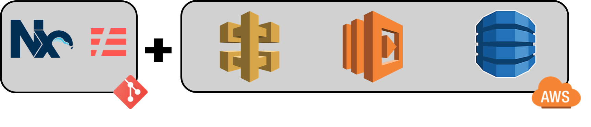
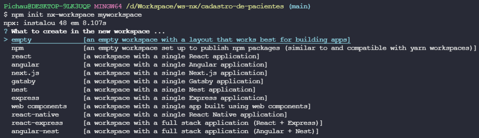
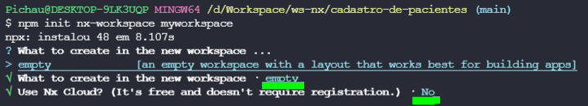

# cadastro-de-pacientes

API RESTFULL com o objetivo de aprender a utilizar monorepos junto ao framework serverless



## Instalações

```
npm i -g @nrwl/cli
```


Iniciando nossa área de trabalho

```
npm init nx-workspace myworkspace
```





como meu repositorio criado, vou iniciar o projeto com NodeJS

```
cd myworkspace && npm install --save-dev @nrwl/node
```

